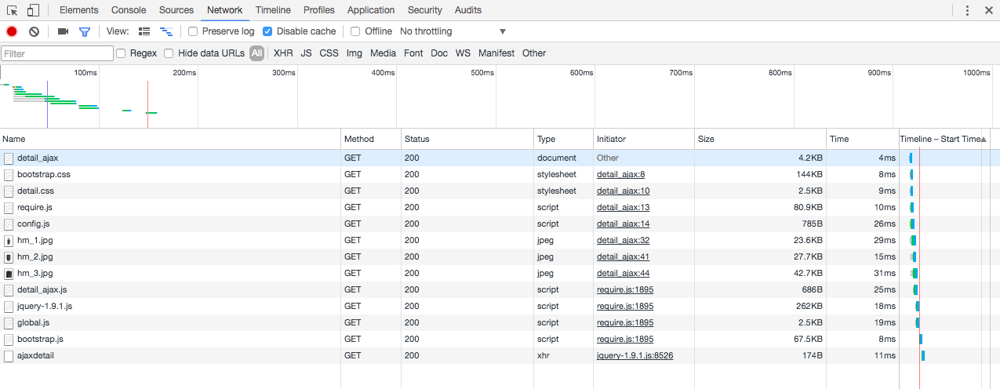

==================
Ajax extract
==================

------------------
Goal
------------------

Recently many websites get product info through ajax request so it make sense for us to quickly figure out how it works and find a way to get the real data.

You should create a spider which have name ``ajax_extract``

Once you finish the coding just run ``scrapy crawl ajax_extract --loglevel=INFO`` to check the output

------------------
Entry
------------------

Remember to change the port number if it is not 8000

http://127.0.0.1:8000/content/detail_ajax

------------------
taskid
------------------

taskid::

    ajax_extract

------------------
Detail of task
------------------

In this task we try to crawl product title and price info. You should find out that the value in html is not the one you see in your brower.

The real data is fetched by ajax request.

You can check the network panel of your brower to find out ajax url the browser used and try to implement it in your spider.

The final data should be::

    [{
        "data": {
            "price": "$ 12.99",
            "title": "MAMA Jersey Top"
        },
        "taskid": "ajax_extract"
    }]

------------------
Advanded
------------------

.. note::

    You must be able to use tools of browser to analyze http request. see :ref:`chrome-web-tools`.

