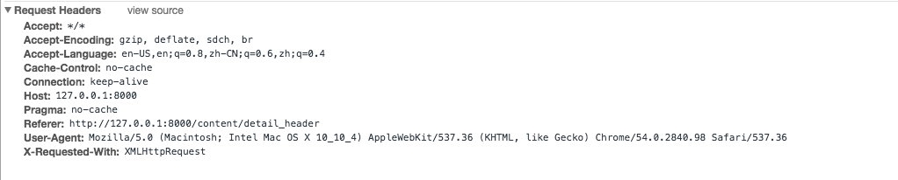

==================
Ajax Header
==================

------------------
Goal
------------------

Some backend systems would check http header to avoid some illegal request.  So we need to make sure the request from our spider will hsave the same value as we see in the browser.

You should check the http header in the browser first and then implement it in your spider.

You should create a spider which have name ``ajax_header``

Once you finish the coding just run ``scrapy crawl ajax_header --loglevel=INFO`` to check the output

------------------
Entry
------------------

Remember to change the port number if it is not 8000

http://127.0.0.1:8000/content/detail_header

------------------
taskid
------------------

taskid::

    ajax_header

------------------
Detail of task
------------------

In this task we try to crawl product title and price info. You should find out that the value in html is not the one you see in your brower.

The real data is fetched by ajax request.

You can check the network panel of your brower to find out ajax url the browser used and try to implement it in your spider.

The final data should be::

    [{
        "data": {
            "price": "$ 12.99",
            "title": "MAMA Jersey Top"
        },
        "taskid": "ajax_header"
    }]

------------------
Advanded
------------------

.. note::

    Actually you can use some proxy tools to help you analyze http request easier, visit :ref:`mitmproxy`.
