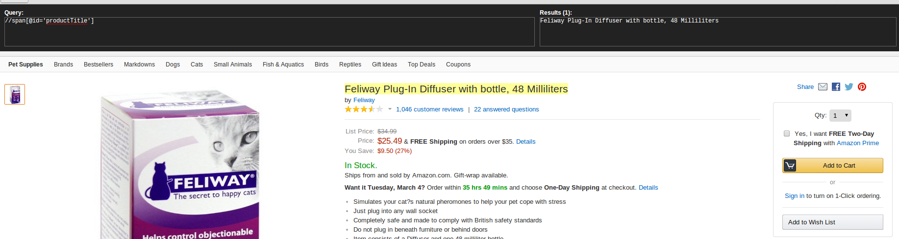
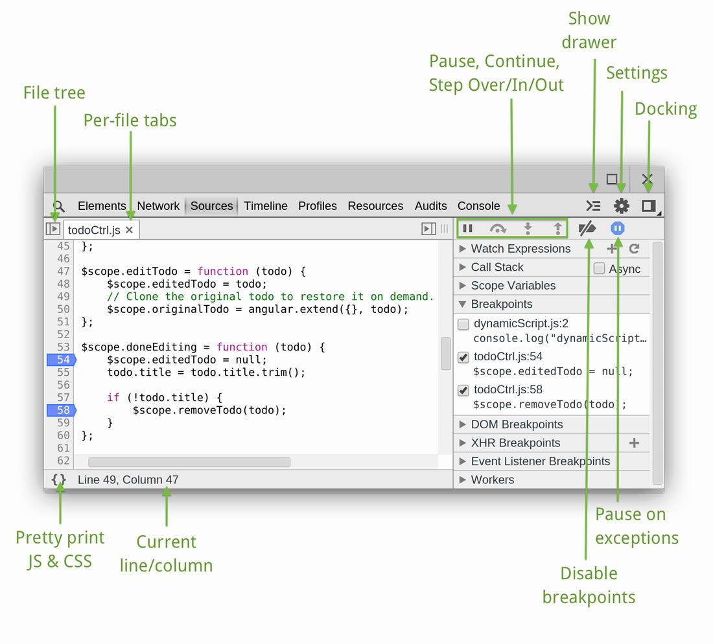

======================
Enhance your browser
======================

.. _chrome-incognito:

--------------------
Incognito mode
--------------------

Incognito mode is also called ``Private Browsing`` in some browser. In this mode the browser does not save cookie and history. This property make it very easy for spider development.

In many cases, we need to find out specific value in cookie to make spider to work, in incognito mode we can easily check the value and got to know how the website might work when spider crawling from a **fresh start**.

If you are using chrome, just follow the steps below

1. In the top-right corner of the browser window, select the Menu 
2. Select New Incognito Window (computer)
3. A new window will open with the Incognito icon 

.. _chrome-xpath-css:

-----------------------------------------------
Quickly test my xpath or css expression
-----------------------------------------------

There are several plugin in browser to support xpath extraction. You can try ``XPath Helper`` in google chrome, which will make it easy to evaluate xpath expression on webpage.

Here is how to use it. Press ``ctrl+shift+x`` to open XPath Helper, and you can see the input and output panel. You can type your xpath query string in the input panel, and the result of the xpath will show on the right side and in the web page the selected content will have a yellow backgroud, which is very easy to check if the xpath expression is right.

.. note::

    What you should concern here is that in some cases the xpath espression which indeed work in browser can not work on raw html becuase some DOM element might been modified by js, so please test it in scrapy shell before write it in spider code.

If you do not want to install extention to make this done, google chrome has built-in support to query xpath and css expression. Take a look at ``$()`` and ``$x()`` in console, and follow this `tutorials <https://doc.scrapy.org/en/latest/index.html>`_.

.. _chrome-web-tools:

-----------------------------------------------
Use web dev tools
-----------------------------------------------

Here is overview screnshot about the web dev tools of google chrome, you can learn more here:  https://developers.google.com/web/tools/chrome-devtools/

---------------------------------------
Debug minified js file in chrome
---------------------------------------

:ref:`chrome-debug-minified-js`.
