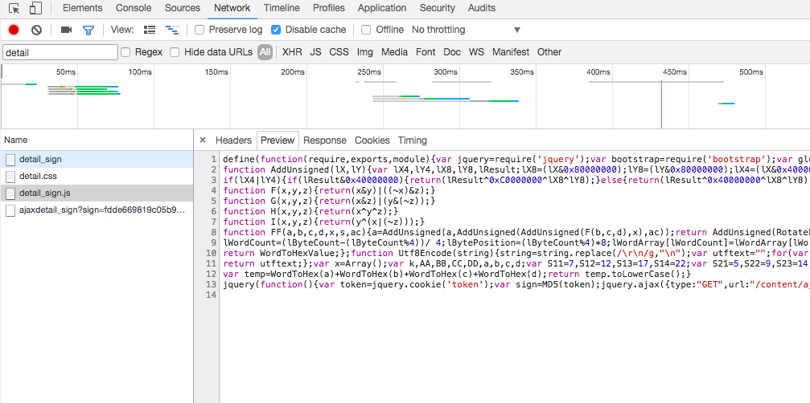
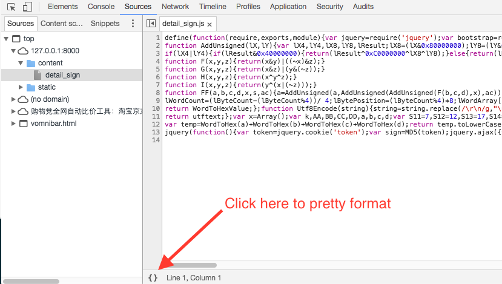
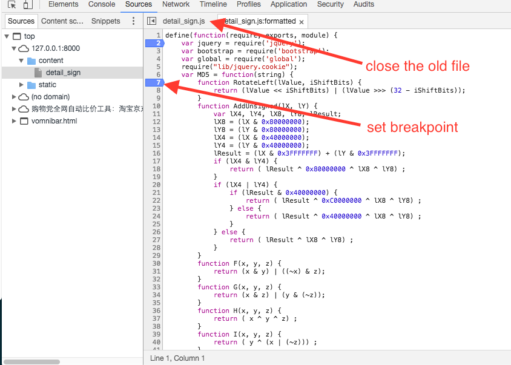
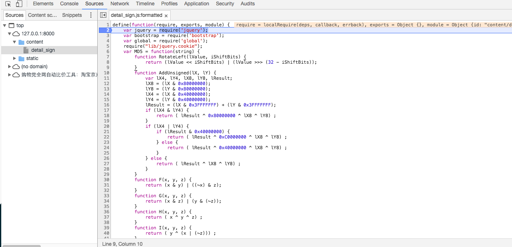
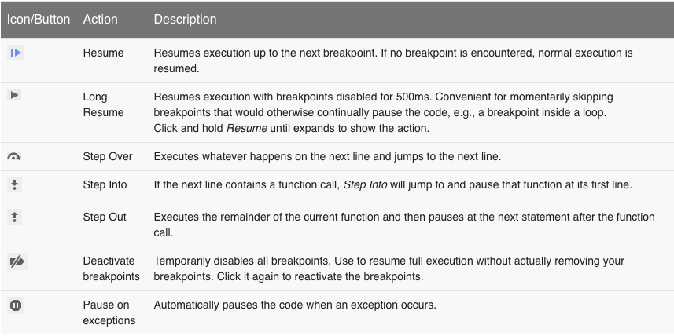

.. _chrome-debug-minified-js:

========================================
How to debug minified js file in chrome
========================================

In this post, I will show you how to use dev tools in chrome to debug a minified js file.

As you can see in the image above, the content in detail_sign.js is minified, and it seems it is hard to read and debug. We should find a way to make the code readable and debug step by step to figure out what happend in this js file.

Follow step to click the button to pretty print the file, now the js code will be reformatted and you can read it. You can set breakpoint in it for later debug. **You should remember to close the old minified file in the tab since in some cases chrome will not work as expect if you keep two files in the tab.**

Now you can reload the page and chrome will block at the breakpoint. you can use debug tools to debug it and check the variable.

Here is cheatsheet of clickable icons.

You can learn more here:  https://developers.google.com/web/tools/chrome-devtools/

