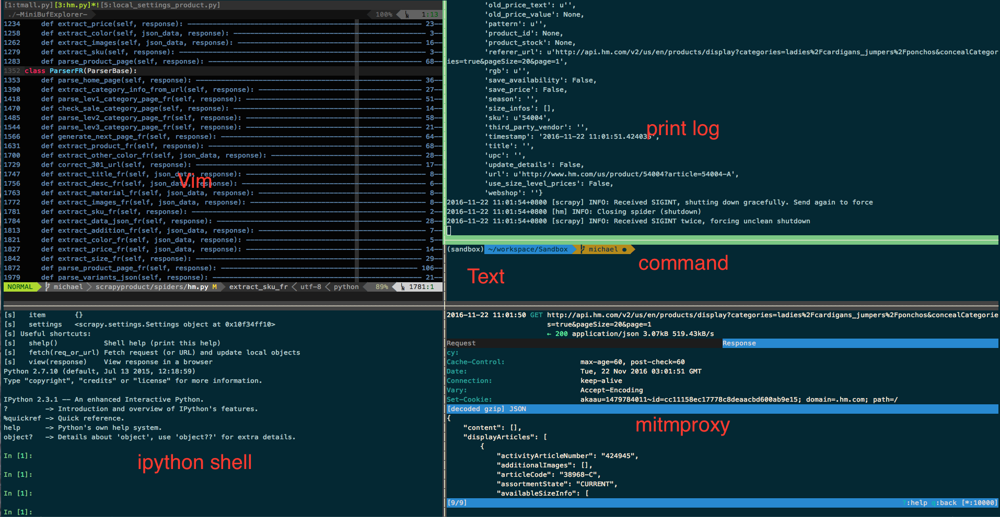

====================
Mitmproxy
====================

--------------------
Intro
--------------------

mitmproxy is an interactive, SSL-capable intercepting proxy with a console interface.

--------------------
Pros and cons
--------------------

Here is list of the popluar network tools user use to inspect http traffic.

+-----------------+--------------+---------------+-----------------+
|  wireshark      |  Fiddler     | Charlesproxy  | Mitmproxy       |
+-----------------+--------------+---------------+-----------------+
| Win, OSX, Linux |  Win         |  OSX          | Win, OSX, Linux |
+-----------------+--------------+---------------+-----------------+
| GUI(Qt, GTK)    |  GUI(Native) |   GUI(Native) |    Console      |
+-----------------+--------------+---------------+-----------------+

As we can see, mitmproxy has no gui interface for newbie user to inspect http request, but in my eyes this is the great advantage because we can launch mitmproxy in terminal and quickly detect http request

-------------------------------------------------------
How to use mitmproxy to speed the development of spider
-------------------------------------------------------

Terminal multiplexer
=====================

If you have experience with tmux or something like this, you should know that the terminal multiplexer can make you switch easily between several programs in one terminal. And this patten can make you focus on the work and make you more effieicent.

So we can run mitmproxy in one of the panel, debug the http request, and start to debug the code quickly after finding something.

Here is the screenshot of my workspace.

You can see I have opened a lot of panels in single one tmux window, I can quickly switch between them and do not need to jump out my favorate terminal env.

Filter
=====================

Sometime you know the website might use some ajax request to get the data you want to scrape, so you go to the network panel of your spider try to check the detail of the request. After you click 10+ links, your are tired and hope some tool can save your life here. 

mitmproxy can really help you here.

You can write filter expression to make mitmproxy filter the request based on the expression. For example, if you want to filter http request which have content ``MAMA Jersey Top`` , you can use the expression ``~b "MAMA Jersey Top"`` , or you can filter the http reqeusrt based on url, response.body, response.header

You can give it a try and I promise you will be surprised.

-------------------------------------------------------
One single note if you want to try mitmproxy
-------------------------------------------------------

When you start to use mitmproxy, it is stronglly recommened to install the CA certificate before you start because if you did not install the CA certificate you can not make mitmproxy inspect https request.

Take a look at this after install.

http://docs.mitmproxy.org/en/stable/certinstall.html

