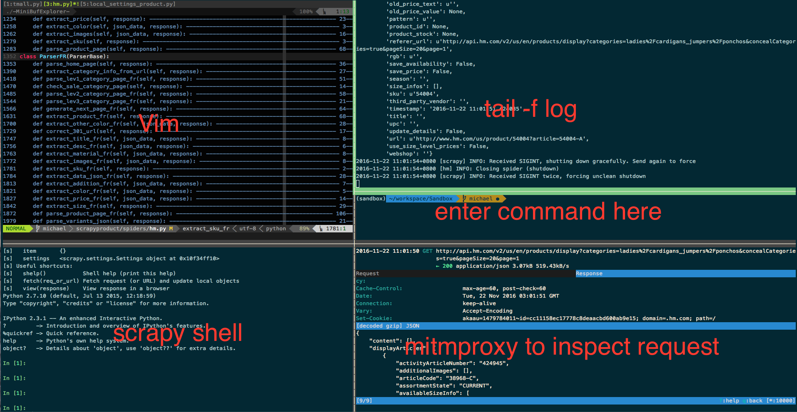

.. _enhance_terminal:

==================================
Enhance your terminal
==================================

.. note::

    If you are newbie developer and have not much experience in terminal, it is not recommended for you to try content below, please focus on basic terminal concepts first. When you can master your terminal env, then you can use the tools below to improve your efficiency.

----------
Tool
----------

You should use good terminal tool before enter terminal world, ``iterm2`` in osx and ``terminator`` in linux are both good tools which worth trying.

----------
Shell
----------

You really need try zsh combined with ``on-my-zsh``, which is a great project in github which have over 40000+ stars. Check it 
`here <https://github.com/robbyrussell/oh-my-zsh>`_

--------------------
Terminal multiplexer
--------------------

Terminal multiplexer can make you switch easily between several programs in one terminal. And this patten can make you focus on the work and make you more effieicent.

You can try ``tmux`` or ``byobu``.

---------------------------
Incremental history search
---------------------------

When you develop spider, you need to run many commands and you will find out that most of them have common patten, and you might need to change some paras and rerun.

At first, you use ``history`` command and use ``grep`` to filter the command you want. The bad part of this approach is that you always need to enter number to select history command.

Here I want to introduce a tool which can make us handle history command more easily. This tool is ``Zaw``, its homepage is https://github.com/zsh-users/zaw .

Its a tools help you select item from ``source``. The source here can be something such as git log, hisotry, programs or others.

The only piece of Zaw that I introduce here is its excellent history search.

We can enter multiple keywords in Zaw and then flip through results until we fount what we want.

.. image:: ../_images/zaw.png

As you can see I enter ``crawl`` then the history will filtered and if I continue to enter ``hm`` then all the commands which have both ``crawl`` and ``hm`` will be filtered out, which is very handy.

Here is a great post talking about the Zaw hisotry search and config.

http://blog.patshead.com/2013/04/more-powerful-zsh-history-search-using-zaw.html

---------------------------
Workspace
---------------------------

Here is the screenshot of my workspace.

You can see I have opened a lot of panels in single one tmux window, I can quickly switch between them and do not need to jump out my favorate terminal env.
