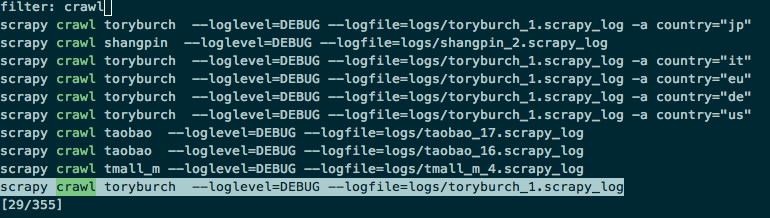

==================================
Enhance your terminal shell
==================================

---------
Zaw
---------

Intro
---------

When you develop spider, you need to run many commands and you will find out that most of them have common patten, and you might need to change some paras and rerun.

At first, you use ``history`` command and use ``grep`` to filter the command you want. The bad part of this approach is that you always need to enter number to select history command.

Here I want to introduce a tool which can make us handle history command more easily. This tool is ``Zaw``, its homepage is https://github.com/zsh-users/zaw .

Incremental history search
---------------------------

Zaw is a ``zsh`` plugin, if you still use bash, I think it is worthwhile to give it a try.

Its a tools help you select item from ``source``. The source here can be something such as git log, hisotry, programs or others.

The only piece of Zaw that I introduce here is its excellent history search.

We can enter multiple keywords in Zaw and then flip through results until we fount what we want.

As you can see I enter ``crawl`` then the history will filtered and if I continue to enter ``hm`` then all the commands which have both ``crawl`` and ``hm`` will be filtered out, which is very handy.

Here is a great post talking about the Zaw hisotry search and config.

http://blog.patshead.com/2013/04/more-powerful-zsh-history-search-using-zaw.html
